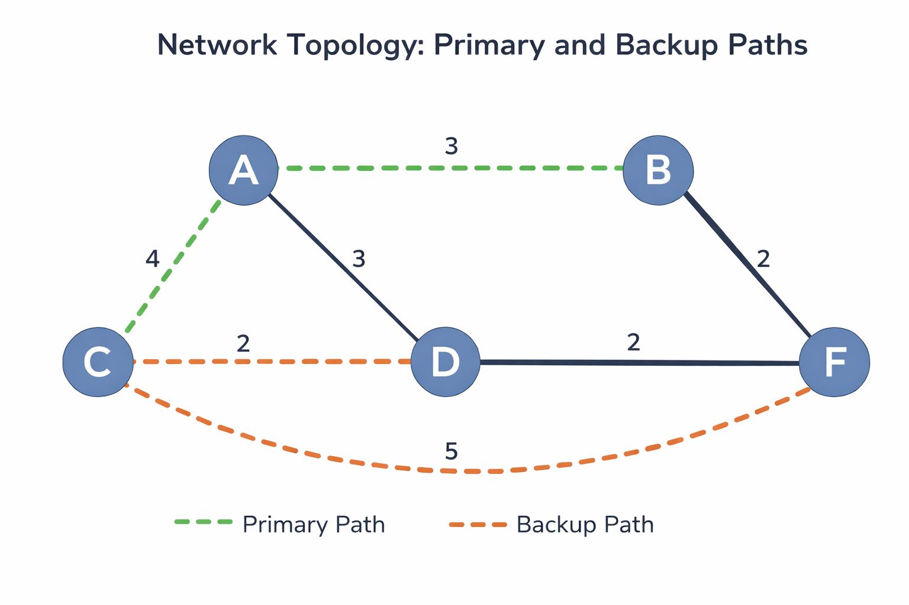

# Optical Network Route Protection using Suurballe’s Algorithm

A simulation-based project that implements Suurballe’s algorithm to compute primary and backup paths for fault-tolerant routing in optical networks.

---

##  Overview

Optical networks require high reliability to ensure uninterrupted communication. This project focuses on designing a route protection mechanism that guarantees continued data transmission even in case of link failures.

The system computes:

* A primary shortest path
* A disjoint backup path

using Suurballe’s algorithm.

---

##  Why This Matters

In real-world networks, failures are inevitable. This project demonstrates how algorithmic approaches can ensure reliability and minimize downtime in critical infrastructure systems.

##  Key Concepts

* Optical Network Routing
* Shortest Path Algorithms
* Suurballe’s Algorithm
* Link Failure Simulation
* Route Protection Mechanisms

---

##  System Architecture

1. Network topology is defined using input data
2. Primary path is computed using shortest path logic
3. Backup path is computed using Suurballe’s algorithm
4. Link failure is simulated
5. Traffic is automatically rerouted through backup path

---

##  Implementation

* Implemented Suurballe’s algorithm for disjoint path computation
* Simulated network behavior under failure conditions
* Verified correctness of backup path switching

---

##  Results

* Successfully computed primary and backup paths
* Demonstrated seamless failover during link failure
* Ensured no data loss during rerouting

---

##  How to Run

```bash
python src/algorithms/suurballe.py
```

or run main simulation:

```bash
python src/simulation/network_simulator.py
```

---
##  Network Visualization

The computed primary and backup paths are shown below:



---
##  Input Format

The network topology is defined in `data/input.txt`:

Example:

```
A B 4
B D 3
A C 2
C E 5
E F 1
D F 2
```

Each line represents:
Node1 Node2 Weight
---

##  Example Output

Primary Path:
A → B → D → F

Backup Path:
A → C → E → F

After link failure (B → D):
System automatically switches to backup path.

---
##  Complexity

* Dijkstra’s Algorithm: O(E log V)
* Suurballe’s Algorithm: O(E log V)

Efficient for medium to large network graphs.
---
##  Failure Simulation

The system simulates link failure and automatically switches to backup path without recomputation.
---

##  Tech Stack

* Python
* Graph Algorithms
* Network Simulation

---

##  Design Trade-offs

* Disjoint path computation increases reliability but adds computational overhead
* Backup path may be longer than primary path
* Trade-off between optimality and resilience

---

##  Applications

* Optical Communication Networks
* Internet Backbone Routing
* Fault-Tolerant Systems
* Network Reliability Engineering

---

##  Contributors

* Shreyas K S
